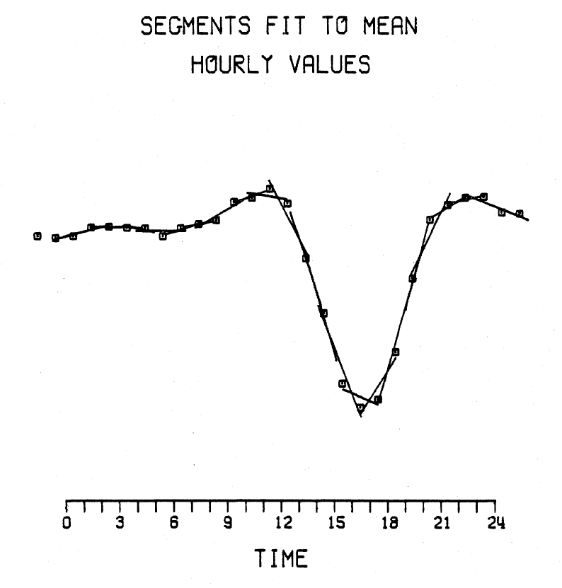

# K-USGS Algorithm #
Algorithm Theoretical Basis for "K-USGS"

E. Joshua Rigler &lt;[erigler@usgs.gov](mailto:erigler@usgs.gov)&gt;

Edward A. McWhirter Jr. &lt;[emcwhirter@usgs.gov](mailto:emcwhirter@usgs.gov)&gt;

## Summary ##

K-Indices are used as an approximate measure of magnetic activity at an
observatory over a 3-hour window. A scale is adopted for each observatory based
on the typical distribution of magnetic activity at that location. The scale is
divided into intervals that a translated to values 0 through 9.

## Background and Motivation ##

The 3-hour K-Index was introduced by [Bartels (1939)](#bartels-1939) as a
measure of irregular and rapid storm-time magnetic activity. This same process
was defined in detail by [Mayaud (1957)](#mayaud-1957). It was designed to be
insensitive to longer term components of magnetic variation and to normalize the
occurrence frequency of individual K values among many observatories, over many
years. Thus, with this method, there is a separate K-Index for each observatory.
It has come to be used much more generally as a measure of the magnetic activity
at an observatory at any given time, as opposed to just during magnetic storms.

The K-USGS algorithm differs from other K-Indices algorithms in one regard. A
non-K variation curve is calculated for each day instead of using the typical
Solar Quiet (SQ) algorithm as an input, which means that K-USGS can be
calculated with just the raw time-series data as inputs.

The USGS has been producing digital K-Indices since 1979. The K-USGS algorithm
was one of many written to attempt to simulate the previously used hand-scaled
process as closely as possible, and was one of the four to be officially
accepted by an IAGA Working Group V during the Vienna IUGG General Assembly in
1991[Menvielle (1995)](#menvielle-1995). This method is described in
"[Wilson (1987)](#wilson-1987). The algorithm was tested and found acceptable
in 1990 using IAGA WG-5 data. It was tested again in 2010 using a subset of
USGS data, and was found to still be acceptable for producing K-Indices.

In general, the K-USGS algorithm consists of these steps:
 1. Eliminate any 1-Minute Values and Mean Hourly Values that fall outside of
    acceptable statistical limits.
 2. Create daily SR-curves for every day in the selected data window.
 3. Subtract the SR-curve to find the K variation of the data.
 4. Translate the K variation on a 0 to 9 scale.

> Subset of USGS data used for testing in 2010 included:
> CMO 1992; FRD 1985-1994,1997; GUA 1992-1994; SJG 1992-1994; TUC 1992-1993

## Math and Theory ##

### Clean the Data ###

A data set for calculating the SR-Curve that K-USGS depends on includes the 24
Mean Hourly Values (MHVs) for a single day plus the last 2 MHVs of the previous
day and the first 2 MHVs of the following day. This is required for each UTC
calendar day in the desired data range. In order to get a good representative
curve of the magnetic activity, some data points should be excluded from
calculations. Any MHVs that are excluded, or don't exist are replaced with a
daily or monthly mean as approprate. The exclusion criteria are:
* MHVs containing minute values having an extreme range.
* MHVs that fall in the tails of the monthly MHV distribution.
TODO: define "extreme".
TODO: define "tails of the distribution"

### SR Curve ###

An SR-curve represents the Solar Regular (SR) daily variation of magnetic
activity. During magnetically quiet periods the SR-curve is generally a smooth
line that follows the form of the magnetic data. This curve represents the
“non-K variation” of the data, and it is calculated for both the Horizontal
Intensity (H) data and the Declination (D) data.

The SR-curve is created by first making a least squares fit of straight lines to
a sliding set of three MHVs to generate a series of intersecting lines. A cubic
spline is then computed with the intercept points of the consecutive lines.

### Translate ###

The K variation is what remains in the data when the SR-curve is subtracted from
the data. The larger of the two K variations, from H and D is used for each time
interval. A time interval is 1 of 8 3-hour windows for every day beginning at
UTC 00:00. Each observatory has an adopted scale, which is a multiple of the
Niemegk observatory’s scale shown below. This scale is used to translate the K
variation nano-Tesla (nT) value of the data onto a 0 to 9 integer scale. The
“Range” represents this nT cutoff for each “KValue”.

    Range:    0     5     10    20    40    70    120   200   330   500
    KValue:   0     1     2     3     4     5     6     7     8     9

For the Niemegk observatory, this means that a K variation below 5nT yields K=0,
a K variation below 10nT yields K=1 and so on.

## Practical Considerations ##

### Magnetic Intensity Units ###

It is understood that all raw data inputs are provided in units of nanoTesla
(nT). Of course this is not required for the equations to be valid, but it is
incumbent on the programmer to make sure all input data units are the same, and
that output units are defined accurately.

### Data Flags ###

It should go without saying that bad data in one coordinate system is bad data
in another. However, on occasion, operational USGS Geomagnetism Program code has
been discovered where coordinate transformations were applied before checking
data flags. This is not an issue if data flags are NaN (not-a-number values),
but more typical for Geomag data, these are values like 99999, which can lead to
seemingly valid, but erroneous values at times when the raw data were known to
be bad.

> Note: this library internally represents data gaps as NaN, and factories
> convert to this where possible.

## References ##

Bartels, J., Heck, N.H., and Johnston, H.F. (1939),
  [The three-hour-range index measuring geomagnetic activity](http://onlinelibrary.wiley.com/doi/10.1029/TE044i004p00411/abstract)
  

Mayaud, P.N., Atlas of indices K, JAGA Bulletin, 21, 113pp., 1957
  

Menvielle, N., 1995,
  [Computer production of K indices: review and comparison of methods](http://gji.oxfordjournals.org/content/123/3/866.short)
  

Wilson, L.R. (1987),
  [An Evaluation of Digitially Derived K-Indices](https://www.jstage.jst.go.jp/article/jgg1949/39/2/39_2_97/_article),
  *J. Geomag. Geoelectr.*, **39**, pp 97-109 
